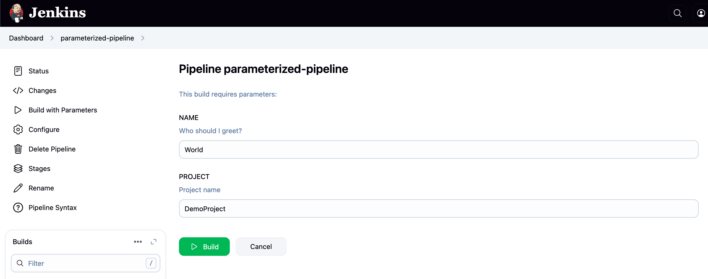
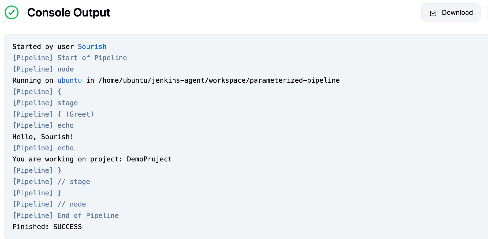

---

## 🚀 Jenkins Parameterized Pipeline Example

[](https://your.jenkins.url/job/your-job-name/)
[](https://www.jenkins.io/doc/book/pipeline/)

This repository contains a simple example of a **Jenkins Declarative Pipeline** using **build parameters**. It demonstrates how to create a parameterized build that accepts user input before executing the pipeline.

---

### 📋 Parameters

The pipeline uses the following parameters:

| Parameter | Type   | Default Value | Description             |
| --------- | ------ | ------------- | ----------------------- |
| `NAME`    | String | `World`       | The name to greet       |
| `PROJECT` | String | `DemoProject` | The name of the project |

---

### 🛠️ Pipeline Script

```groovy
pipeline {
    agent any

    parameters {
        string(name: 'NAME', defaultValue: 'World', description: 'Who should I greet?')
        string(name: 'PROJECT', defaultValue: 'DemoProject', description: 'Project name')
    }

    stages {
        stage('Greet') {
            steps {
                echo "Hello, ${params.NAME}!"
                echo "You are working on project: ${params.PROJECT}"
            }
        }
    }
}
```


### Jenkins File

The complete Jenkins pipeline script is available in the [Jenkinsfile](./Jenkinsfile) in this directory.

---

### 📦 How to Use

1. Open Jenkins and create a new **Pipeline** job.
2. In the job configuration:

   * Scroll to the **Pipeline** section.
   * Select **Pipeline script** or link this repo using **Pipeline script from SCM**.
3. Paste the pipeline script (if not using SCM).
4. Save the job.
5. Click **Build with Parameters**.
6. Enter values for `NAME` and `PROJECT` and run the job.

---

### 📸 Screenshots

#### Build with Parameters



#### Console Output Logs



---

### 📄 License

This project is open source and available under the [MIT License](../../LICENSE.md).

---