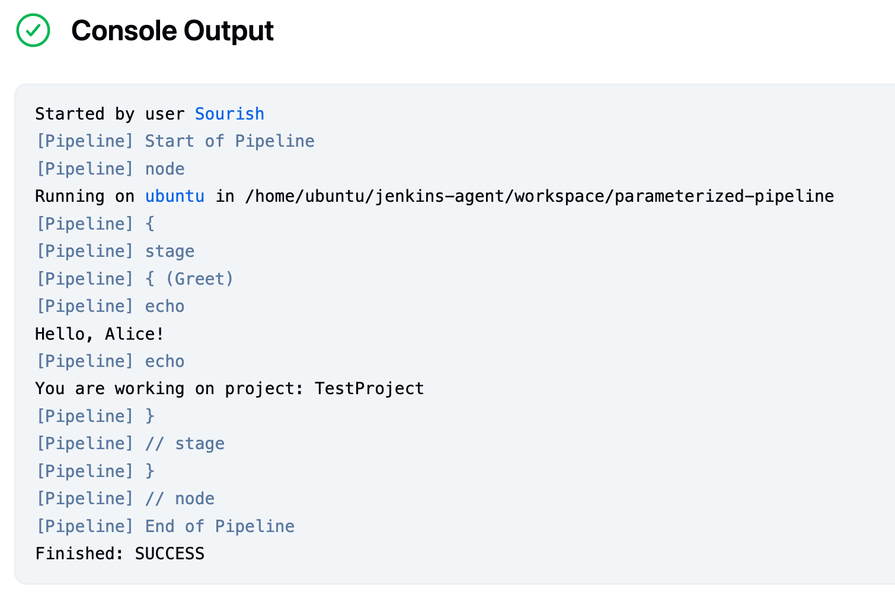

## 🚀  How to To **trigger your Jenkins pipeline remotely with parameters**, 


We can use the **Jenkins REST API** with a token-authenticated **HTTP POST** request. Here's a complete guide to do this securely and properly:

---
### ✅ Step-by-Step: Trigger Jenkins Pipeline Remotely with Parameters

### 🔧 1. **Enable Remote Access**

Ensure that:

* Jenkins is accessible via HTTP(S) from where you’re triggering it.
* CSRF Protection and authentication tokens are properly configured.

---

### 🔑 2. **Create API Token (if you don’t have one)**

Go to your Jenkins user profile:

* `Jenkins > YourUser > Configure > API Token`
* Click **“Add new Token”**, give it a name, and save the token securely.

---

### 🌐 3. **URL Format for Remote Trigger with Parameters**

You can use this `curl` command:

```bash
curl -X POST "http://<jenkins_url>/job/<job_name>/buildWithParameters" \
  --user "<username>:<api_token>" \
  --data-urlencode "NAME=Alice" \
  --data-urlencode "PROJECT=TestProject"
```

🔁 Replace with your own parameters:

* `<jenkins_url>`: e.g., `jenkins.example.com`
* `<job_name>`: name of the Jenkins job (freestyle or pipeline job)
* `<username>` and `<api_token>`: your credentials

---

### 🚀 Example for Your Pipeline

Assume:

* Jenkins URL: `http://jenkins.local:8080`
* Job name: `GreetJob`
* Username: `admin`
* Token: `1234abcd5678efgh`

```bash
curl -X POST "http://jenkins.local:8080/job/GreetJob/buildWithParameters" \
  --user "admin:1234abcd5678efgh" \
  --data-urlencode "NAME=Alice" \
  --data-urlencode "PROJECT=CoolProject"
```

---

### 🔐 Optional: If Jenkins Uses Crumb (CSRF Protection)

If CSRF is enabled, get the crumb first:

```bash
# Get crumb
CRUMB=$(curl -s -u admin:1234abcd5678efgh 'http://jenkins.local:8080/crumbIssuer/api/xml?xpath=concat(//crumbRequestField,":",//crumb)')

# Trigger job with crumb
curl -X POST "http://jenkins.local:8080/job/GreetJob/buildWithParameters" \
  -H "$CRUMB" \
  --user "admin:1234abcd5678efgh" \
  --data-urlencode "NAME=Alice" \
  --data-urlencode "PROJECT=CoolProject"
```

---

### 📸 Screenshots



---
### 🌍 If You Want to Use a Webhook

You can configure a webhook from another system (e.g., GitHub or a service like Zapier) to send a `POST` request to the same URL with the appropriate parameters.

Just make sure the webhook supports:

* `POST` requests
* HTTP basic authentication or Bearer token headers
* URL-encoded form data

---