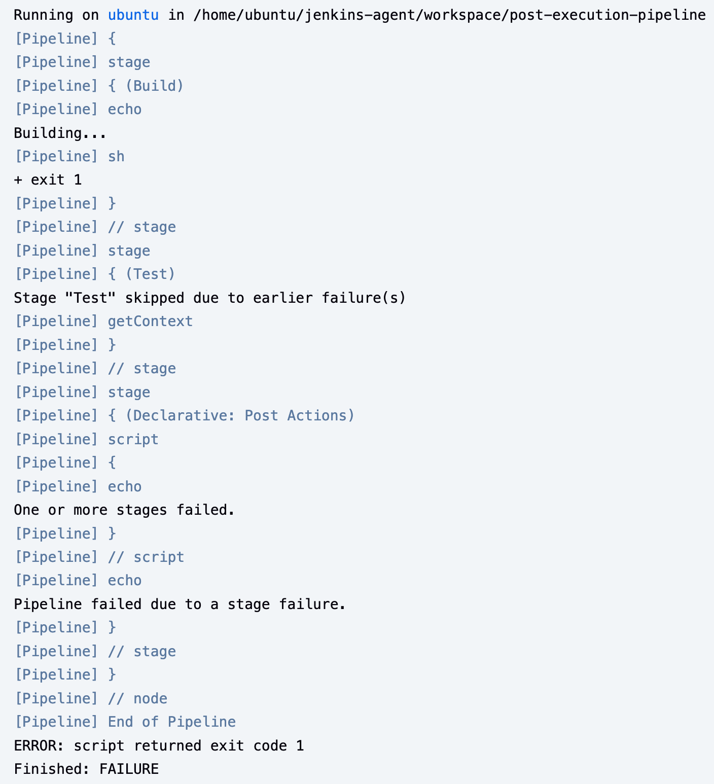

---

# 🚀 Jenkins Pipeline Post-Execution Example

[](https://your.jenkins.url/job/your-job-name/)
[](https://www.jenkins.io/doc/book/pipeline/)

This repository demonstrates a Jenkins pipeline with post-execution handling capabilities. The pipeline showcases how to implement error handling, success notifications, and failure management in Jenkins declarative pipelines.

---

## 📝 Pipeline Explanation

- **Declarative pipeline** with 2 stages (Build and Test) and post-execution actions
-  **Build stage** is set to fail intentionally (`exit 1`)
-  **Test stage** will pass (`exit 0`)
-  **Post section** handles different execution outcomes
-  Error handling logic in the 'always' block
-  Provides success and failure notifications

---

## 🗂️ Pipeline Structure

### 🛠️ Stages

1. ** Build Stage**
  - Simulates a build process
  - Intentionally fails for demonstration purposes

2. ** Test Stage**
  - Simulates a test execution
  - Set to succeed

### 🏁 Post-Execution Handlers

The pipeline includes three post-execution blocks:

- **🔄 Always**: Runs regardless of the pipeline outcome  
  -  Checks build status  
  -  Logs failure information  
  -  Can force specific build results

- **🎉 Success**: Executes only on successful pipeline completion  
  -  Displays success message

- **❗ Failure**: Executes only when pipeline fails  
  -  Displays failure message

---

### 🛠️ Pipeline Script

```groovy
pipeline {
    agent any

    parameters {
        string(name: 'NAME', defaultValue: 'World', description: 'Who should I greet?')
        string(name: 'PROJECT', defaultValue: 'DemoProject', description: 'Project name')
    }

    stages {
        stage('Greet') {
            steps {
                echo "Hello, ${params.NAME}!"
                echo "You are working on project: ${params.PROJECT}"
            }
        }
    }
}
```


### 📄 Jenkins File

The complete Jenkins pipeline script is available in the [Jenkinsfile](./Jenkinsfile) in this directory.

--- 

## ▶️ Usage

1. Ensure Jenkins is properly configured
2. Create a new pipeline job
3. Point it to this Jenkinsfile
4. Run the pipeline to observe the post-execution behavior

---

## 🔍 Expected Behavior

- The pipeline will fail due to the intentional `exit 1` in the Build stage
- The 'always' block will execute and log the failure
- The 'failure' block will execute and display the failure message
- The 'success' block will be skipped

---

## 🛠️ Customization

To modify the pipeline behavior:
- Remove `sh 'exit 1'` from Build stage to make it succeed
- Add additional post conditions (unstable, changed, etc.)
- Modify the error handling logic in the 'always' block

---

### 📸 Screenshots

#### Console Output Logs



## 📄 License

This project is licensed under the MIT License - see the [LICENSE.md](../../LICENSE.md) file for details.
